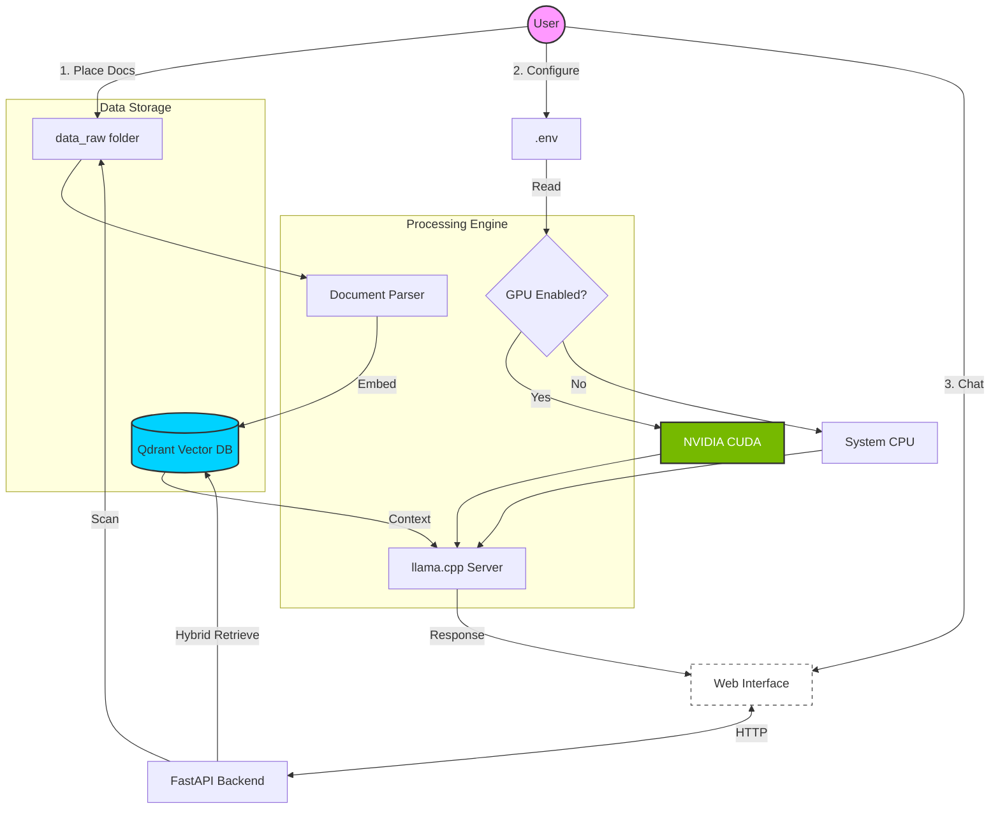
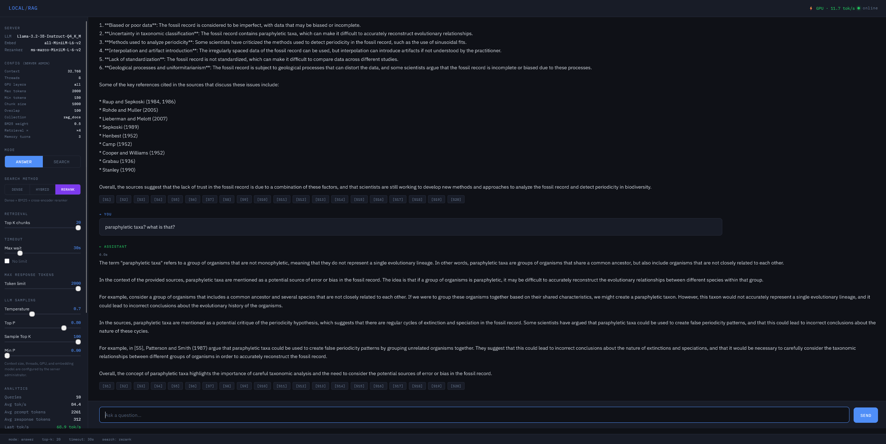

# Local RAG Server

A fully local retrieval-augmented generation (RAG) system for querying PDF and DOCX documents using a local LLM. Designed for multi-user deployment on corporate networks — no cloud, no API keys.

```
PDF / DOCX files
      |
      v
 Text extraction & cleaning
      |
      v
 Chunking (overlapping, paragraph-aware)
      |
      v
 all-MiniLM-L6-v2 embeddings (384-dim, CPU friendly)
      |
      v
 Qdrant (local vector store)
      |
      v
 Hybrid retrieval (Dense + BM25 + optional cross-encoder reranker)
      |
      v
 FastAPI + llama.cpp  →  Browser UI
```

---



## Web UI

Once running, the web UI is accessible at `http://localhost:8000` from the machine running the stack.

**Accessing from other devices on your network:**
If you're running Local RAG on a server or another machine, access it via the host's IP address:
```
http://192.168.x.x:8000
```

**Exposing to the internet:**
Use a reverse proxy like [Caddy](https://caddyserver.com/) or [nginx](https://nginx.org/) in front of port 8000, or use a tunnel like [Cloudflare Tunnel](https://developers.cloudflare.com/cloudflare-one/connections/connect-networks/) for zero-config public access.

> **Warning:** There is no authentication built in — if exposing publicly, put it behind a password-protected reverse proxy.

### Screenshot



---

## Platform Support

| Platform | Docker | Native |
|---|---|---|
| Linux | `./run.sh --docker` | `./run.sh` |
| macOS | `./run.sh --docker` | `./run.sh` |
| Windows | `start.bat` | WSL2 only |

**Windows users:** Just install [Docker Desktop](https://www.docker.com/products/docker-desktop/) and double-click `start.bat` — no WSL2, Python, or manual setup needed.

**Linux/macOS native:** Requires Docker only for Qdrant. Everything else runs directly on your machine via `./run.sh`.

---

## GPU Acceleration

| Hardware | Expected Speed |
|---|---|
| CPU only (4-8B model) | 3–15 tok/s |
| NVIDIA GPU (4070 Ti) | 100–150 tok/s |
| NVIDIA GPU (3090/4090) | 150–200 tok/s |

GPU setup instructions are in the [Enabling GPU](#enabling-gpu) section below.

---

## Requirements

- Python 3.10+
- Docker
- Git, CMake, and a C++ compiler (native workflow only)

On Ubuntu:
```bash
sudo apt install build-essential cmake git docker.io python3-venv python3-full
sudo usermod -aG docker $USER && newgrp docker
```

---

## Quick Start

### 1. Clone the repo

```bash
git clone https://github.com/burnoutmonk/local-rag-server.git
cd local-rag-server
```

### 2. Add your documents

Place PDF and DOCX files in the `data_raw/` folder.

### 3. Configure

```bash
cp .env.example .env
```

Open `.env` and set at minimum:
- `LLM_MODEL_FILE` — filename of your GGUF model (downloaded automatically)
- `LLM_MODEL_REPO` — HuggingFace repo to download from
- `LLM_THREADS` — number of CPU cores to use
- `LLM_GPU_LAYERS` — set to `-1` to use GPU, `0` for CPU only

### 4. Start everything

---

#### Option A — Windows (Docker Desktop)

Install [Docker Desktop](https://www.docker.com/products/docker-desktop/) then double-click `start.bat` or run:

```cmd
start.bat
```

This starts all services in the background, waits until everything is ready, and opens your browser automatically at `http://localhost:8000`.

To stop:
```cmd
docker compose down
```

To enable GPU:
```env
# in .env
CUDA_AVAILABLE=true
LLM_GPU_LAYERS=-1
```
Then re-run `start.bat`.

---

#### Option B — Linux / macOS (Docker)

```bash
cp .env.example .env    # adjust if needed
./run.sh --docker
```

Opens your browser automatically when ready. Same GPU settings as above via `.env`.

To stop:
```bash
docker compose down
```

---

#### Option C — Linux / macOS (Native)

Runs everything directly on your machine without Docker (except Qdrant). Easier to debug and faster iteration during development.

```bash
chmod +x run.sh
./run.sh
```

This automatically:
1. Creates a Python virtual environment and installs dependencies
2. Builds llama.cpp from source (first run only — takes 10–20 minutes)
3. Downloads the model from HuggingFace
4. Starts Qdrant via Docker
5. Ingests documents from `data_raw/`
6. Measures LLM speed and updates `config.py`
7. Starts the web UI at `http://localhost:8000`

Press `Ctrl+C` to stop all services.

Useful flags:
```bash
./run.sh --skip-ingest   # skip ingestion if documents haven't changed
./run.sh --skip-llm      # skip LLM server if already running
```

---

## Startup Optimizations

The Docker stack is optimized for fast restarts when nothing has changed:

| Service | First run | Subsequent restarts |
|---|---|---|
| `model_downloader` | Downloads GGUF from HuggingFace | Shell `test -f` — exits in <1s |
| `ingest` | Parses, chunks, and embeds all documents | Hash check only — skips embedding model load entirely |
| `benchmark` | Waits for LLM, measures tok/s | Sees `.benchmarked_cpu` or `.benchmarked_gpu` marker — exits in <1s |

The benchmark uses separate marker files for CPU and GPU modes so switching `LLM_GPU_LAYERS` always triggers a re-measurement on the next startup.

To force a fresh benchmark, delete the appropriate marker file from the project root:
```bash
# GPU mode
rm .benchmarked_gpu
# CPU mode
rm .benchmarked_cpu
```

---

## Configuration

All settings live in `config.py` (native) and `.env` (Docker). They share the same values — environment variables in `.env` override the defaults in `config.py`.

### LLM & Model

| Setting | Default | Description |
|---|---|---|
| `LLM_MODEL_FILE` | `Llama-3.2-3B-Instruct-Q4_K_M.gguf` | GGUF model filename |
| `LLM_MODEL_REPO` | `bartowski/Llama-3.2-3B-Instruct-GGUF` | HuggingFace repo |
| `LLM_THREADS` | `8` | CPU threads for inference |
| `LLM_CONTEXT` | `4096` | Context window size (GPU: use 32768+) |
| `LLM_GPU_LAYERS` | `0` | GPU layers (`-1` = all, `0` = CPU only) |
| `LLM_TEMPERATURE` | `0.7` | Sampling temperature |
| `LLM_TOP_P` | `0.8` | Nucleus sampling threshold |
| `LLM_TOP_K` | `20` | Top-K sampling |
| `LLM_MIN_P` | `0.0` | Min-P sampling |
| `MAX_TOKENS` | `500` | Max output tokens |
| `MIN_TOKENS` | `150` | Min output tokens (timeout estimation floor) |
| `TOKENS_PER_SECOND` | `10.0` | Measured hardware speed (set by benchmark) |
| `CUDA_AVAILABLE` | `false` | Build llama.cpp with CUDA support |

### Chunking

| Setting | Default | Description |
|---|---|---|
| `MAX_CHARS` | `1000` | Max chars per chunk |
| `OVERLAP_CHARS` | `100` | Chunk overlap in chars |
| `EMBED_MODEL_NAME` | `sentence-transformers/all-MiniLM-L6-v2` | Embedding model (changing requires full re-ingest) |

### Chat Memory

| Setting | Default | Description |
|---|---|---|
| `CHAT_MEMORY_TURNS` | `3` | Previous Q&A exchanges to include per session (0 to disable) |

### Hybrid Retrieval

| Setting | Default | Description |
|---|---|---|
| `BM25_WEIGHT` | `0.5` | BM25 fusion weight (0 = dense only, 1 = BM25 only) |
| `RETRIEVAL_MULTIPLIER` | `4` | Candidates fetched = `top_k × multiplier` before reranking |
| `RERANKER_MODEL` | `cross-encoder/ms-marco-MiniLM-L-6-v2` | Cross-encoder model for reranking |
| `RERANKER_ENABLED` | `true` | Allow users to enable reranking (set to `false` to disable globally) |

> **Note:** LLM sampling parameters (temperature, top_p, top_k, min_p) and max tokens can be adjusted per-query from the web UI sidebar. The `.env` values are the defaults.

---

## Hybrid Search

Retrieval uses a two-stage pipeline with user-selectable modes:

**Dense** — Qdrant cosine similarity search only (fastest).

**Hybrid** (default) — Dense search retrieves `top_k × RETRIEVAL_MULTIPLIER` candidates, then BM25 scores are computed on those candidates and fused with dense scores using `BM25_WEIGHT`.

**Hybrid + Rerank** — Adds a cross-encoder pass after Hybrid. The cross-encoder scores all candidates as (query, text) pairs and re-orders them. Adds 1–3 seconds of latency but improves precision for complex queries.

Users select the search mode via the three buttons in the UI sidebar. The rerank button is greyed out if `RERANKER_ENABLED=false` on the server.

---

## Chat Memory

Each browser tab gets an independent session (via `sessionStorage`). The server keeps the last `CHAT_MEMORY_TURNS` exchanges (default 3) in memory per session, prepending them to each LLM prompt for conversational context.

Sessions expire automatically after 2 hours of inactivity. Clicking "Clear chat" in the UI starts a new session and discards prior history.

---

## Enabling GPU

Using a GPU massively improves generation speed — expect 100–150 tok/s on a 4070 Ti vs 5–15 tok/s on CPU.

**Which CUDA version?** Install **CUDA 12** — it is stable, widely supported, and what llama.cpp officially targets.

---

### Windows (Docker — recommended)

> Tested and working with a 4070 Ti on Windows 11 + Docker Desktop.

1. Make sure you have an up to date NVIDIA driver — download from [nvidia.com/drivers](https://www.nvidia.com/Download/index.aspx)
2. Verify: open CMD and run `nvidia-smi`
3. Set in `.env`:
```env
CUDA_AVAILABLE=true
LLM_GPU_LAYERS=-1
```
4. Delete `.benchmarked_gpu` if it exists (to force re-measurement)
5. Run `start.bat` — Docker pulls the CUDA 12 toolkit automatically inside the container, no local CUDA install needed

---

### Linux / WSL2 (Native)

1. Install CUDA 12 toolkit:
```bash
wget https://developer.download.nvidia.com/compute/cuda/repos/ubuntu2404/x86_64/cuda-keyring_1.1-1_amd64.deb
sudo dpkg -i cuda-keyring_1.1-1_amd64.deb
sudo apt update && sudo apt install cuda-toolkit-12-6
echo 'export PATH=/usr/local/cuda/bin:$PATH' >> ~/.bashrc
echo 'export LD_LIBRARY_PATH=/usr/local/cuda/lib64:$LD_LIBRARY_PATH' >> ~/.bashrc
source ~/.bashrc
```
2. Verify: `nvcc --version`
3. Delete old llama.cpp build so it rebuilds with CUDA:
```bash
rm -rf llama.cpp/build
```
4. Set in `config.py`: `LLM_GPU_LAYERS = -1`
5. Run `./run.sh`

> **WSL2 users:** First install the [NVIDIA WSL2 driver](https://developer.nvidia.com/cuda/wsl) on Windows, then follow the steps above inside WSL.

---

### Linux / WSL2 (Docker)

1. Follow the CUDA toolkit install steps above
2. Set in `.env`:
```env
CUDA_AVAILABLE=true
LLM_GPU_LAYERS=-1
```
3. Delete `.benchmarked_gpu` to re-measure speed with GPU
4. Run `./run.sh --docker`

---

## Managing the Docker Stack

### Common operations

```bash
docker compose -f docker/docker-compose.yml up -d        # start all services
docker compose -f docker/docker-compose.yml down         # stop all services
docker compose -f docker/docker-compose.yml logs -f      # follow logs from all services
docker compose -f docker/docker-compose.yml logs -f api  # follow logs from a specific service
```

Or use `start.bat` / `run.sh --docker` which handle the `-f` paths automatically.

### When to rebuild

Most changes do NOT require a rebuild — just restart:

| Change | Action |
|---|---|
| `.env` parameters (tokens, threads, context) | Restart: `start.bat` or `./run.sh --docker` |
| New model | Update `.env`, then restart |
| New/changed documents in `data_raw/` | Restart — ingest detects changes automatically |
| Python code changes | `docker compose -f docker/docker-compose.yml build api && start.bat` |
| Switch GPU layers on/off | Set `LLM_GPU_LAYERS` in `.env`, delete `.benchmarked_gpu` or `.benchmarked_cpu`, restart |
| Switch CPU build to GPU build | Set `CUDA_AVAILABLE=true` in `.env`, then `start.bat` (full rebuild) |
| Change embedding model | Update `EMBED_MODEL_NAME` in `.env`, then `docker volume rm local_rag_ingest_state` and restart |

### Switching models

1. Edit `.env` and set the new `LLM_MODEL_FILE` and `LLM_MODEL_REPO`
2. Delete `.benchmarked_gpu` or `.benchmarked_cpu` (new model = different speed)
3. Restart — `model_downloader` will automatically fetch the new model

### Re-ingesting documents

Ingestion runs automatically on startup and only processes changed or new files (tracked via MD5 hashes). Deleted files are automatically detected and removed from the vector store. To force a full re-ingest:

```bash
docker volume rm local_rag_ingest_state
```

---

## API Endpoints

### `POST /answer`
Retrieves relevant chunks via hybrid search and generates an answer with the LLM.
```bash
curl -X POST http://localhost:8000/answer \
  -H "Content-Type: application/json" \
  -d '{"query": "what is X", "top_k": 5, "mode": "answer", "timeout": 60}'
```

Full request options:
```json
{
  "query": "what is X",
  "top_k": 5,
  "mode": "answer",
  "timeout": 60,
  "max_tokens": 500,
  "temperature": 0.7,
  "top_p": 0.8,
  "llm_top_k": 20,
  "min_p": 0.0,
  "session_id": "optional-uuid-for-chat-memory",
  "use_bm25": true,
  "use_reranker": false
}
```

### `POST /answer` (search mode)
Returns raw retrieved chunks without calling the LLM. Useful for debugging retrieval.
```bash
curl -X POST http://localhost:8000/answer \
  -H "Content-Type: application/json" \
  -d '{"query": "what is X", "top_k": 5, "mode": "search"}'
```

### `POST /search`
Dedicated search endpoint — returns scored chunks with metadata.

### `GET /metrics`

Returns per-query analytics history for the current server session (tok/s, prompt tokens, response tokens, response time).

### `GET /health`
Returns server status including GPU/CUDA state, model info, measured tok/s, and full server configuration.

---

## Project Structure

```
.
├── data_raw/                  # Place your PDF and DOCX files here
├── models/                    # GGUF model downloaded here automatically
├── docker/
│   ├── docker-compose.yml     # Full stack orchestration
│   ├── docker-compose.gpu.yml # GPU overlay (merged by start.bat/run.sh)
│   ├── Dockerfile             # CPU image for all Python services
│   └── Dockerfile.cuda        # GPU image (CUDA 12, nvidia base)
├── scripts/
│   ├── benchmark.py           # LLM speed benchmark (Docker)
│   ├── test_speed.py          # Manual LLM speed test (native)
│   └── qdrant_test.py         # Qdrant connectivity test
├── templates/
│   └── index.html             # Browser UI (single file, no build step)
├── config.py                  # All settings (native workflow)
├── .env.example               # All settings (Docker workflow) — copy to .env
├── run.sh                     # Linux/macOS entry point (native or --docker)
├── start.bat                  # Windows entry point (Docker)
├── start.py                   # Native launcher (Qdrant + ingest + LLM + API)
├── ingest.py                  # Parse, chunk, embed, and upsert into Qdrant
├── rag_api.py                 # FastAPI retrieval + LLM answer API
├── download_model.py          # Auto model downloader (Docker)
└── requirements.txt
```

---

## Testing & Benchmarking RAG Accuracy

### Evaluate Retrieval + LLM Quality

The `rag_test.py` script measures how well your RAG system performs on real documents:

1. **Generates test questions** from random chunks in your ingested documents
2. **Tests all 3 search modes** (Dense / Hybrid / Hybrid+Rerank) on the same questions
3. **Scores retrieval accuracy** (did it find the right source file?) and **answer accuracy** (is the answer correct?)
4. **Reports results** showing retrieval %, answer %, and response time per mode

This is useful for:
- Tuning chunking size, overlap, and retrieval settings
- Comparing search mode performance on your specific documents
- Validating that configuration changes improve quality

**Run the test:**

**Windows (Docker):**
```cmd
test.bat
```

**Linux/macOS (Docker):**
```bash
chmod +x test.sh
./test.sh
```

**Docker directly:**
```bash
docker compose -f docker/docker-compose.yml --profile test run rag_test
```

The script:
- Samples random chunks from your collection
- Generates 20 Q&A pairs (customizable: `--questions 100`)
- Tests all search modes
- Scores answers using the LLM as a judge
- Saves results to `test_results.json`

**Sample output:**
```
══════════════════════════════════════════════════════════
RAG Accuracy Test Report
══════════════════════════════════════════════════════════
Questions tested:    20
Unique source files: 8

Search Mode       Retrieval %   Answer %   Avg Time (s)
─────────────────────────────────────────────────────────
Dense               80.0%        70.0%       1.1
Hybrid              90.0%        80.0%       1.4
Hybrid+Rerank       95.0%        88.0%       3.2
══════════════════════════════════════════════════════════
```

**Note:** The test must run against a running stack (start with `start.bat` or `run.sh --docker` first).

---

## Supported Document Formats

Ingest.py supports the following file types:

| Format | Handling |
|--------|----------|
| **PDF** | Text extraction per page, cleaned for OCR artifacts |
| **DOCX** | Paragraphs grouped by heading styles |
| **PPTX** | One section per slide, text from all shapes |
| **XLSX / XLS** | One section per sheet, rows formatted as text |
| **CSV** | Rows formatted as `key=value` (wide CSVs) or pipe-separated (normal) |
| **JSON** | Flattened to `path.to.key: value` for structure-aware search |
| **TXT / MD** | Read as-is, chunked by paragraphs |

Place files in `data_raw/` — they're automatically detected on startup.

---

## Docker & Dependency Changes

### Do I need to rebuild Docker if I change requirements.txt?

**Yes.** If you add or update Python dependencies in `requirements.txt`:

```bash
# Windows
docker compose -f docker/docker-compose.yml build api ingest benchmark
start.bat

# Linux/macOS
docker compose -f docker/docker-compose.yml build api ingest benchmark
./run.sh --docker
```

The `build` command rebuilds the images with the new dependencies. You only need to rebuild the services that use the updated code (usually `api`, `ingest`, `benchmark`). The `qdrant` and model images don't need rebuilding.

**Why?** Docker images are immutable. Dependencies are baked in at build time. Code changes don't require a rebuild (Docker can reload them), but dependency changes do.

---

## Tips

- **Search method:** Hybrid (Dense + BM25) is the default. Switch to Dense for the fastest results or Hybrid + Rerank for the best precision on complex queries.
- **Retrieval quality:** `top_k=5` is a good default. Increase if answers feel incomplete.
- **Chunk size:** `MAX_CHARS=1000` works well for most documents. Reduce to 600–700 for documents with many short definitions.
- **Incremental ingestion:** Only changed or new files are re-ingested. Deleted files are automatically removed from the vector store.
- **LLM sampling:** Adjust temperature, top_p, top_k, and min_p from the sidebar in the web UI — changes apply per-query without restarting.
- **Max response tokens:** Use the slider in the UI to control response length. The admin-configured `MAX_TOKENS` value is the ceiling.
- **Chat memory:** Each browser tab maintains its own session. "Clear chat" in the UI starts a fresh session. Set `CHAT_MEMORY_TURNS=0` in `.env` to disable memory entirely.
- **Analytics:** The sidebar tracks tok/s and response time per query with live sparkline graphs. System stats (CPU, RAM, GPU) show peak values since page load.
- **Config panel:** The UI sidebar shows a read-only view of server admin settings (context window, threads, GPU layers, chunk size, reranker model, etc.).
- **CPU context warning:** If running in CPU mode with a context window above 4096, the UI shows a warning — large contexts are very slow on CPU.
- **GPU toggle:** Set `LLM_GPU_LAYERS=-1` or `0` in `.env` and restart. The benchmark auto-detects the mode and re-runs automatically when you switch.
- **Re-benchmark:** Delete `.benchmarked_gpu` or `.benchmarked_cpu` from the project root to force a speed measurement on next startup.

---

## License

MIT — see [LICENSE](LICENSE)
